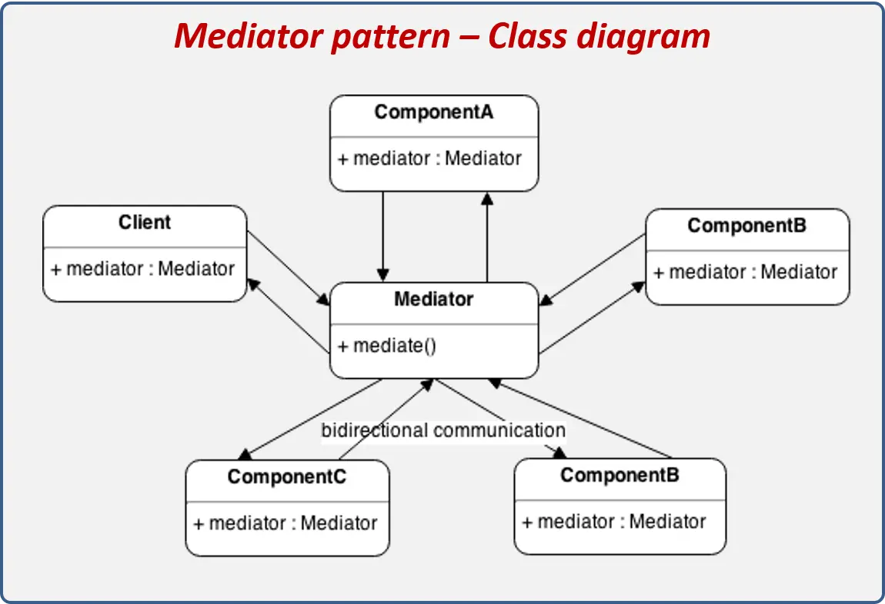

# ✨ Mediator 패턴

## 1. 패턴 정의: 정의와 핵심 요약

- Mediator 패턴은 여러 컴포넌트(객체) 간 직접 통신을 막고, 중간 매개체를 통해 메시지나 요청을 전달함으로써 결합도를 낮추는 패턴이다.
- 컴포넌트들이 서로 직접 참조하지 않고, 중앙의 매개체만을 통해 활동하며 내부 구조를 분리할 수 있다.

## 2. 사용 목적: 이 패턴이 필요한 이유

- 복잡한 객체 간의 의존 관계가 생기고, 수정 시 여러 객체에 영향이 가는 설계가 발생할 때 사용된다.
- Mediator를 통해 통신을 제어하면, 각 객체는 중앙 제어자와만 의사소통하고 서로는 몰라도 되기 때문에 응집도는 높이고 결합도는 낮출 수 있다.
- 예시: 채팅 애플리케이션에서 사용자들끼리 직접 메시지를 주고받는 대신, 채팅룸이 중개자 역할을 하며 메시지 흐름을 제어하는 구조.

## 3. 패턴 설명: 동작 방식과 구성 요소



> 구성 요소

- Mediator(중개자/미들웨어): 객체 간 통신 흐름을 조정하는 역할. 메시지를 받고 적절한 대상에게 전달한다.

- 리시버/송신자 객체: 서로 개별적으로 통신하는 대신 Mediator에게 메시지를 보내거나, Mediator로부터 알림을 받는다.

> 동작 흐름

- A 객체가 특정 작업을 요청할 때 Mediator에게 전달한다.
- Mediator는 이 요청을 확인한 뒤, B 객체에게 전달하거나 적절한 처리를 수행한다.
- B 객체는 Mediator를 통해 요청을 받고 응답한다.
- Mediator는 필요한 경우 A로 응답하거나 추가 처리를 수행한다.

> 장점

- 컴포넌트 간 직접적인 의존이 줄어 유지보수와 테스트 용이
- 중앙에서 통신 흐름을 제어 가능해 로직 변경 시 유연성 확보

> 단점

- 중앙 Mediator가 복잡해지면 유지보수가 어려워질 수 있음
- 올바른 분리 설계 없이는 중개자의 책임이 무거워질 수 있음

## 4. 코드 및 활용 예시: 기본 구현과 프론트엔드 적용

```ts
// Mediator 역할의 ChatRoom 구현 예시
class ChatRoom {
  logMessage(user, message) {
    const time = new Date().toISOString();
    console.log(`${time} [${user.getName()}]: ${message}`);
  }
}

class User {
  constructor(name, chatroom) {
    this.name = name;
    this.chatroom = chatroom;
  }
  getName() {
    return this.name;
  }
  send(message) {
    this.chatroom.logMessage(this, message);
  }
}

// 사용 예시
const room = new ChatRoom();
const alice = new User("Alice", room);
const bob = new User("Bob", room);

alice.send("Hello Bob!"); // Mediator 통해 메시지 전달
bob.send("Hi Alice!");
```

## 5. 정리와 확장: 학습 포인트와 추가 학습거리

### 학습 포인트

- 복잡한 컴포넌트 간 직접 의존을 제거하고, 중앙 매개체를 통해 메시지 전달 및 흐름 제어 가능
- Mediator 패턴은 설계 구조를 단순화하고, 객체간 통신을 중앙 집중적으로 관리하게 해줌

### 추가 학습: Proxy 패턴과 비교

| 구분                 | Mediator (중재자)                                             | Proxy (대리자)                                                 |
| -------------------- | ------------------------------------------------------------- | -------------------------------------------------------------- |
| **목적**             | 여러 객체 간 직접 연결을 끊고, 모든 상호작용을 중앙에서 조율  | 실제 객체에 대한 접근을 제어하거나, 동작 전후에 부가 기능 추가 |
| **관계 구조**        | 여러 컴포넌트가 Mediator만 바라봄 → 서로 모름                 | 클라이언트는 Proxy를 실제 객체처럼 사용                        |
| **초점**             | 객체 간 커뮤니케이션을 단순화하고, 결합도를 낮춤              | 하나의 객체에 대한 접근, 성능, 보안, 로깅, 지연 로딩 등        |
| **비유**             | 회의 진행자: 참가자끼리 직접 대화 안 하고, 진행자를 통해 발언 | 대리인: 의뢰인이 직접 계약하지 않고 대리인을 통해 계약         |
| **주 사용 시나리오** | 이벤트 버스, 채팅방 메시지 라우팅, UI 위젯 간 조율            | 가상 프록시(지연 로딩), 보호 프록시(권한 제어), 캐시 프록시    |
| **UML 구조**         | Mediator는 다수의 Colleague와 양방향 연결                     | Proxy는 RealSubject와 동일 인터페이스를 구현                   |

> 쉽게 정리

- Mediator → “여러 명이 말하면 복잡하니까 내가 중간에서 조율할게” → 다대다 관계를 중앙 집중형으로 단순화
- Proxy → “그 사람한테 직접 가지 말고, 나를 통해서만 해” → 1:1 관계에서 접근 경로를 바꿔치기
