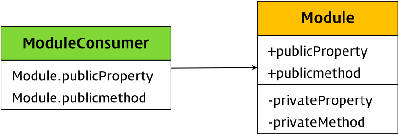

# ✨ Module 패턴

## 1. 패턴 정의: 정의와 핵심 요약

- 모듈 패턴은 관련 있는 변수와 함수를 하나의 독립된 스코프 안에 캡슐화하고, 외부에 필요한 부분만 명시적으로 공개하는 패턴이다.
- 전역 네임스페이스 오염을 방지하고, 코드의 재사용성과 유지보수성을 높인다.

## 2. 사용 목적: 이 패턴이 필요한 이유

- 프로젝트가 커질수록 전역 네임스페이스에 변수를 무분별하게 추가하면 이름 충돌과 예기치 않은 동작이 발생할 수 있다.
- 모듈 패턴은 관련 기능과 데이터를 하나의 독립된 스코프에 묶어, 외부에서는 공개 인터페이스(public interface)로만 접근하도록 한다.
- 이를 통해 내부 구현 세부사항(변수, 헬퍼 함수 등)은 은닉하고, 필요한 함수나 상수만 외부에 노출할 수 있다.

## 3. 패턴 설명: 동작 방식과 구성 요소



> 구성요소

1. 모듈(Module): 관련된 데이터와 기능을 하나의 파일 또는 함수 스코프 안에 정의한다.

- 내부 변수/함수: 외부에 노출되지 않음 (private)
- export로 지정된 항목만 외부에서 접근 가능 (public)

2. 외부 사용부(Consumer): 모듈에서 필요한 기능만 import하여 사용한다.

- 명시적으로 가져오기 때문에 의존성이 명확하다.

> 동작 방식

- 모듈 내부는 독립된 스코프를 가진다.
- 외부에서 접근 가능한 항목은 `export`를 통해 선택적으로 노출한다.
- `import` 구문으로 필요한 기능만 가져올 수 있으며, 이 과정에서 트리 쉐이킹(tree-shaking) 같은 최적화가 적용된다.

> Export 방식

```ts
// utils.ts
export function add(a: number, b: number) {
  return a + b;
} // Named export
export default function multiply(a: number, b: number) {
  return a * b;
} // Default export

// main.ts
import multiply, { add } from "./utils";
```

1. Named Export

- 여러 개 가능
- 가져올 때 동일한 이름을 사용해야 함 (`import { fn } from ...`)

2. Default Export

- 모듈당 하나만 가능
- 가져올 때 이름을 자유롭게 지정 가능 (`import anything from ...`)

## 4. 코드 및 활용 예시: 기본 구현과 프론트엔드 적용

### 기본 모듈 구현

```ts
// mathUtils.ts
const PI = 3.14; // 외부에 공개하지 않을 내부 상수

export function add(a: number, b: number) {
  return a + b;
}

export function circleArea(r: number) {
  return PI * r * r;
}
```

```ts
// main.ts
import { add, circleArea } from "./mathUtils";

console.log(add(1, 2)); // 3
console.log(circleArea(10)); // 314
```

### React에서의 모듈 패턴

```ts
// useModal.ts
import { useState } from "react";

export function useModal() {
  const [isOpen, setIsOpen] = useState(false);

  return {
    isOpen,
    open: () => setIsOpen(true),
    close: () => setIsOpen(false),
  };
}

// App.tsx
import { useModal } from "./useModal";

const App = () => {
  const { isOpen, open, close } = useModal();
};
```

- useModal 훅은 모듈처럼 동작하며, 모달 상태와 제어 함수를 외부에 공개한다.
- 내부 구현(useState 사용 방식)은 외부 컴포넌트에서 알 필요가 없다.

## 5. 정리와 확장: 학습 포인트와 추가 학습거리

### 학습 포인트

- 모듈 패턴은 기능과 데이터를 하나의 독립된 단위로 묶고, 필요한 것만 외부에 공개하는 구조다.
- 전역 네임스페이스 오염 방지, 명시적 의존성 관리, 캡슐화를 통해 코드의 유지보수성과 재사용성을 높인다.
- ES2015 이후의 모듈 문법(`import/export`)과 함께 사용하면 빌드 단계 최적화와 연결된다.

### 추가 학습: 스코프 호이스팅

최근 재밌는 블로그 글을 보았다.

- Devon의 [JavaScript scope hoisting is broken](https://devongovett.me/blog/scope-hoisting.html)
- [번역글](https://velog.io/@sehyunny/js-scope-hoisting-is-broken)

스코프 호이스팅이라는 번들 최적화 기법이 실제로는 코드 스플리팅과 충돌하고, 특정 상황에서는 런타임 동작에 문제를 일으킬 수 있다는 내용이었다.

이번 모듈 학습 과정에서 빌드 단계에서 모듈이 어떻게 병합되고 실행되는지, 그리고 이 과정이 런타임 동작에 미치는 영향을 다시 점검할 수 있었다.

자바스크립트 번들러에는 스코프 호이스팅(scope hoisting)이라는 최적화 기법이 구현되어 있다.

이 기법은 각 모듈을 별도의 함수로 감싸는 대신, 여러 모듈을 하나의 단일 스코프로 병합해 실행하는 방식이다.

그 결과, 함수 호출 오버헤드가 줄어들고 번들 크기가 작아질 수 있다.

> 코드 스플리팅과의 충돌 위험성

- 스코프 호이스팅은 근본적으로 코드 스플리팅과 상충할 수 있다.
- 번들링 과정에서 코드 스플리팅 알고리즘이 빌드 전과 다른 순서로 모듈을 `import`하게 될 수 있다.
- 이렇게 되면 모듈의 실행 순서가 어긋나 예기치 않은 동작이 발생할 수 있다.
- 특히 공유 모듈이 여러 청크에 걸쳐 사용되는 경우, 스코프 호이스팅이 적용되면 실행 순서 보장이 어려워진다.
- 따라서 번들 설계나 번들러 설정 시, 스코프 호이스팅이 코드 스플리팅과 충돌할 수 있음을 염두에 두어야 한다.

> 그 밖의 부작용

- 스코프 호이스팅 적용 과정에서 `export`된 함수 내부의 `this` 값이 깨질 수 있다.
- 모듈 병합 시 함수 컨텍스트가 변경되면서, 원래 의도한 `this` 참조가 달라질 수 있기 때문이다.
- 특히 객체 메서드를 그대로 `export`하는 경우 이런 문제가 발생할 수 있어, 필요한 경우 `.bind()`나 화살표 함수로 컨텍스트를 명시적으로 고정하는 방식이 권장된다.

### 추가 학습: 모듈 시스템(ESM vs CommonJS)

자바스크립트에는 대표적으로 ESM(ECMAScript Modules)과 CommonJS라는 두 가지 모듈 시스템이 존재한다.

이 둘은 모듈을 정의하고 불러오는 방식, 그리고 동작 시점에서 큰 차이를 가진다.

> 1.ESM (ECMAScript Modules)

- ECMAScript 표준에서 정의한 모듈 시스템으로, `import` / `export` 구문을 사용한다.
- 정적 로딩을 기반으로 하여, 모듈 구조를 빌드 타임에 분석할 수 있다.
- 정적 분석이 가능하기 때문에 트리 쉐이킹(tree-shaking) 같은 최적화에 유리하다.
- 브라우저와 최신 Node.js 환경에서 네이티브로 지원된다.

> 2. CommonJS (CJS)

- Node.js에서 기본으로 사용되는 모듈 시스템으로, `require` / `module.exports`를 사용한다.
- 동적 로딩을 허용하므로, 런타임에 조건적으로 모듈을 불러올 수 있다.
- 런타임 로딩 특성상 정적 분석이 어려워, 트리 쉐이킹 최적화에는 불리하다.

> 차이점 정리

- 로딩 시점: ESM은 정적(빌드 타임), CJS는 동적(런타임)
- 최적화: ESM은 트리 쉐이킹에 최적, CJS는 한계 존재
- 호환성: Node.js는 두 시스템을 모두 지원하지만, 브라우저는 ESM만 직접 실행 가능

### 추가 학습: 번들러와 모듈

번들러는 다양한 모듈 파일을 읽어들여, 브라우저나 실행 환경에서 동작 가능한 형태로 하나 이상의 번들 파일로 변환한다.

이 과정에서 번들러는 모듈 시스템 간의 변환과 최적화를 함께 수행한다.

> 1. Webpack

- ESM과 CJS를 모두 지원하며, 호환성에 강점이 있다.
- `ModuleConcatenationPlugin`을 통해 스코프 호이스팅을 지원하며, 코드 스플리팅과 트리 쉐이킹을 제공한다.
- 다양한 로더(loader)와 플러그인 생태계로 유연한 빌드 구성이 가능하다.

> 2. Rollup

- ESM 기반 번들에 특화된 번들러로, 기본적으로 스코프 호이스팅을 적용한다.
- 사용하지 않는 코드를 제거하는 트리 쉐이킹에 강점이 있다.
- 라이브러리 번들링에 적합하며, 브라우저 애플리케이션 빌드에도 사용 가능하다.

> 3. Vite

- 개발 서버 단계에서는 브라우저 네이티브 ESM(브라우저가 import/export 문법을 직접 해석·실행하는 방식)을 활용하여 빠른 HMR(Hot Module Replacement)을 제공한다.
- 프로덕션 빌드 시 Rollup을 사용하여 최적화된 번들을 생성한다.
- ESM을 기본으로 사용하되, 필요 시 CJS 모듈도 변환하여 포함시킨다.

> 번들러 최적화 포인트

- 트리 쉐이킹: 사용하지 않는 코드를 제거해 번들 크기를 줄인다.
- 코드 스플리팅: 필요한 시점에만 로드되는 청크로 분리한다.
- 스코프 호이스팅: 모듈 경계를 제거하여 런타임 성능을 개선한다(단, 일부 제약 존재).
