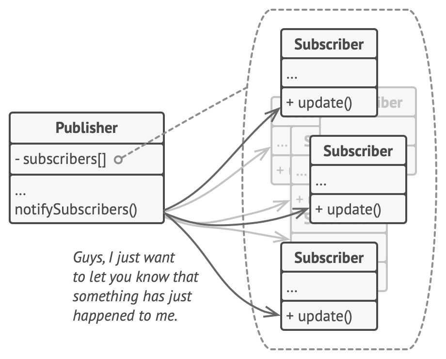

# ✨ Observer 패턴

## 1. 패턴 정의: 정의와 핵심 요약

- 옵저버 패턴은 한 객체의 상태 변화가 있을 때, 그 객체에 의존하는 다른 객체들(옵저버)에게 자동으로 알림을 보내는 패턴이다.
- 주로 이벤트 시스템, 구독/발행 모델 등에서 사용된다.

## 2. 사용 목적: 이 패턴이 필요한 이유

- 상태 변화가 여러 객체에 영향을 미쳐야 하는 상황에서 결합도를 낮추고, 유연하게 전파 구조를 설계할 수 있다.
- 이벤트 기반 시스템, UI 상태 관리, 데이터 흐름 구성에 적합하다.

## 3. 패턴 설명: 동작 방식과 구성 요소



> 구성 요소

1. Publisher (Subject): 상태 변화의 주체이며, 구독된 옵저버들에게 알림을 전파하는 역할을 한다.

- 내부적으로 아래 메서드와 상태를 가진다:
  - `observers`: 알림을 받을 Subscriber 목록
  - `subscribe(fn)`: 옵저버 등록
  - `unsubscribe(fn)`: 옵저버 제거
  - `notify(data)`: 등록된 옵저버 모두에게 이벤트 전파

2. Subscriber (Observer): Publisher에 등록되어 이벤트나 상태 변화를 감지하고 반응하는 함수나 객체이다.

- 보통 콜백 함수의 형태로 구현되며, `notify()` 호출 시 자동으로 실행된다.

> 동작 방식

- Publisher는 상태를 갖고 있고, 이에 관심 있는 Subscriber들을 내부 배열에 저장한다.
- 외부에서 `subscribe()`를 호출해 옵저버를 등록할 수 있다.
- 상태 변화나 이벤트가 발생하면 `notify()`를 호출해 모든 등록된 옵저버에게 알림을 보낸다.
- 더 이상 반응이 필요 없는 옵저버는 `unsubscribe()`로 제거한다.

## 4. 코드 및 활용 예시: 기본 구현과 프론트엔드 적용

### 기본 Publisher, Subscriber 구현

```ts
type Observer = (data: any) => void;

class Publisher {
  private observers: Observer[] = [];

  // 옵저버 등록
  subscribe(observer: Observer) {
    this.observers.push(observer);
  }

  // 옵저버 제거
  unsubscribe(observer: Observer) {
    this.observers = this.observers.filter((fn) => fn !== observer);
  }

  // 모든 옵저버에게 이벤트 전파
  notify(data: any) {
    this.observers.forEach((observer) => observer(data));
  }
}
```

```ts
const newsPublisher = new Publisher();

const subscriberA = (data: any) => console.log("📰 A received:", data);
const subscriberB = (data: any) => console.log("📰 B received:", data);

newsPublisher.subscribe(subscriberA);
newsPublisher.subscribe(subscriberB);

newsPublisher.notify("🚨 Breaking News!");
// 출력:
// 📰 A received: 🚨 Breaking News!
// 📰 B received: 🚨 Breaking News!

newsPublisher.unsubscribe(subscriberA);
newsPublisher.notify("🗞 Daily Update");
// 출력:
// 📰 B received: 🗞 Daily Update
```

### 리액트에서의 옵저버 패턴

> Redux의 store.subscribe()

```ts
const unsubscribe = store.subscribe(() => {
  console.log(store.getState());
});

// 구독을 해제할 때
unsubscribe();
```

- `store.subscribe()`는 구독자 등록
- 상태 변경 시 내부적으로 `notify()`와 유사한 방식으로 모든 리스너에게 알림 전파
- Zustand, Recoil, Jotai 등 다른 상태 관리 라이브러리도 유사한 옵저버 구조를 내부적으로 사용

> React Router v5의 history.listen()

```ts
import { createBrowserHistory } from "history";

const history = createBrowserHistory();

history.listen((location, action) => {
  console.log("📍 라우트 변경 감지:", location.pathname);
});
```

- `listen()` 메서드는 옵저버를 등록하는 `subscribe()` 역할
- URL이 변경될 때 등록된 모든 리스너에 알림 (notify)
- v6 이후에는 내부 구조로 감춰졌지만, v5까지는 명시적으로 옵저버 패턴을 활용

## 5. 정리와 확장: 학습 포인트

### 학습 포인트

- 옵저버 패턴은 Publisher(Subject) 와 Subscriber(Observer) 사이의 일대다 관계를 구성해, 상태 변화가 발생하면 관련된 모든 Observer에게 알릴 수 있도록 한다.
- `subscribe()`, `unsubscribe()`, `notify()` 메서드를 통해 주체(Publisher)가 구체적인 구독자(Observer)에 대해 알 필요 없이 변화만 전파한다.
- 이러한 구조는 Publisher와 Observer 간 결합도를 낮춰 시스템 확장이나 유지보수를 유연하게 만든다. (예: 새로운 Observer를 추가하거나 제거할 때 Publisher 코드에는 영향이 없다.)
