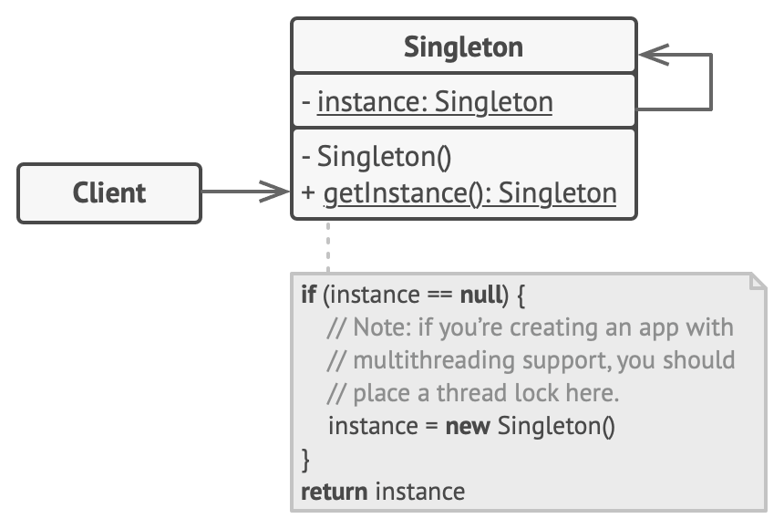

# ✨ Singleton 패턴

## 1. 패턴 정의: 공식 정의와 핵심 요약

- 최초 1회만 인스턴스 생성이 가능하고, 전역에서 접근 가능한 객체를 생성하는 패턴이다.

## 2. 사용 목적: 이 패턴이 필요한 이유

- 애플리케이션 전체에서 단 하나의 인스턴스만 필요할 때 사용한다. (예: DB 연결)
- 여러 인스턴스를 생성하면 리소스 낭비나 상태 불일치 문제가 생길 수 있다.
- 전역 변수처럼 어디서나 접근 가능하면서도, 오직 하나만 존재하도록 안전하게 제어할 수 있는 방법이 필요할 때 적합하다.

## 3. 패턴 설명: 동작 방식과 구성 요소



> 동작 방식

- 생성자 접근 차단: 생성자를 `private`으로 지정하여 외부에서 직접 객체를 생성하지 못하도록 막는다.

- 정적 인스턴스 보관: 클래스 내부에 `static` 필드로 인스턴스를 저장한다.

- 정적 메서드로 접근: `getInstance()` 같은 정적 메서드를 통해 인스턴스를 반환한다.

  - 인스턴스가 없으면 새로 생성하고, 있으면 기존 인스턴스를 그대로 반환한다.

## 4. 코드 및 활용 예시: 기본 구현과 프론트엔드 적용

> 기본 구현

- 클라이언트가 `getInstance()` 호출
- 클래스 내부에 인스턴스가 없으면 `new`로 생성
- 이후 호출은 기존 인스턴스를 그대로 반환

```ts
class Singleton {
  private static instance: Singleton;

  private constructor() {
    console.log("🟢 Singleton instance created");
  }

  static getInstance(): Singleton {
    if (!this.instance) {
      this.instance = new Singleton();
    }
    return this.instance;
  }

  public log(message: string) {
    console.log(`📘 ${message}`);
  }
}

const logger1 = Singleton.getInstance();
const logger2 = Singleton.getInstance();

console.log(logger1 === logger2); // true
```

> 사용 예시: 모달 컨트롤러

- 앱에 여러 곳에서 모달을 띄우되, 하나만 떠야 하는 UI 구조일 때
- 하나의 전역 모달 컨트롤러로 열기/닫기 요청을 통합

```ts
class ModalController {
  private static instance: ModalController;
  private subscribers: ((visible: boolean) => void)[] = [];

  private constructor() {}

  static getInstance() {
    if (!this.instance) this.instance = new ModalController();
    return this.instance;
  }

  subscribe(fn: (visible: boolean) => void) {
    this.subscribers.push(fn);
  }

  open() {
    this.subscribers.forEach((fn) => fn(true));
  }

  close() {
    this.subscribers.forEach((fn) => fn(false));
  }
}
```

## 5. 정리와 확장: 학습 포인트와 추가 학습거리

### 학습 포인트

- 이전에는 단순히 하나의 인스턴스를 여러 곳에서 공유하는 것만으로 이해하고 있었지만, 이제는 '인스턴스의 생성 자체를 통제하고, 전역 접근을 안전하게 관리하는 패턴'이라는 점에서 더 구조적이고 책임 있는 설계 방식이라는 걸 알게 되었다.

### 추가 학습: `Object.freeze()`

- `Object.freeze()` 메서드는 객체를 동결해 수정을 방지한다.
- 동결된 객체는 새로운 속성을 추가하거나 존재하는 속성을 제거하는 것을 방지하며 존재하는 속성의 불변성을 보장한다.
- 참고: [MDN - Object.freeze()](https://developer.mozilla.org/ko/docs/Web/JavaScript/Reference/Global_Objects/Object/freeze)

```ts
const obj = {
  prop: 42,
};

Object.freeze(obj);

obj.prop = 33;
// Throws an error in strict mode

console.log(obj.prop);
// Expected output: 42
```

- 인스턴스가 하나만 존재하더라도, 내부 상태가 외부에서 변경될 수 있다면 싱글톤의 신뢰성은 깨질 수 있다.
- `Object.freeze()`를 사용하면 해당 인스턴스를 불변 객체로 만들 수 있어, 외부에서 속성을 추가하거나 수정, 삭제하는 것을 방지할 수 있다.
- 특히 설정 객체, 상태 저장소 등 읽기 전용으로 쓰이길 기대하는 싱글톤에선 매우 유용하다.

```ts
const instance = new Singleton();
Object.freeze(instance);
```

### 추가 학습: ES Module

- ES Module 자체가 싱글톤처럼 작동한다.
- import한 모듈은 한 번만 실행되며, 이후 재사용된다. (모듈 캐싱)
- 모듈 스코프에서 정의된 객체나 값은 전역처럼 공유된다.

```ts
// a.mjs
console.log("module A loaded");
export const x = 1;
```

```ts
// b.mjs
import { x } from "./a.mjs";
import { x as x2 } from "./a.mjs"; // 다시 import

console.log(x === x2); // true
```

### 추가 학습: 싱글톤 패턴이 안티패턴 취급되는 이유

1. 사실상 전역 상태를 만든다.

- 이렇게 되면 코드의 의존성과 상태 변화가 암묵적으로 일어나고, 디버깅이 어려워지며 모듈 간 결합도가 높아진다.

2. 테스트가 어려워진다

- 싱글톤 인스턴스는 하나뿐이기 때문에 상태를 공유하게 된다.
- 테스트 환경에서 다른 테스트에 영향을 주는 공유 상태가 생기거나, mocking/dummy 객체로 교체하기 어려운 구조가 된다.

3. 의존성 주입을 방해한다

- 싱글톤은 `getInstance()` 같은 정적 메서드를 통해 직접 인스턴스를 생성하고 참조한다.
- 이 방식은 객체 간의 의존 관계를 외부에서 주입하지 않고 내부에서 직접 연결해버리는 것이기 때문에 확장성, 유연성, 테스트 가능성을 떨어뜨린다.
