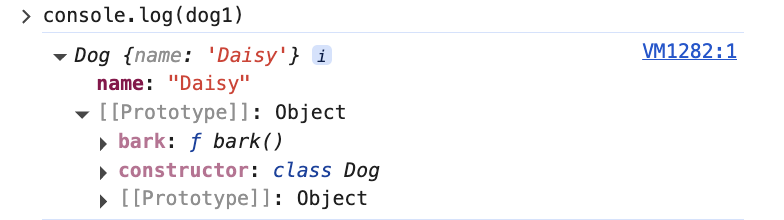

# Prototype

자바스크립트에는 프로토타입 객체에 공통된 속성과 메서드를 정의한다.

이 프로토타입 객체를 인스턴스들이 공유하여 동작하고 이 객체를 통해 상속이 이루어진다.

```ts
class Dog {
  constructor(name) {
    this.name = name
  }

  bark() {
    return `Woof!`
  }
}

const dog1 = new Dog('Daisy')
const dog2 = new Dog('Max')
const dog3 = new Dog('Spot')
```



인스턴스들에 `__proto__`는 그 생성자 함수에 정의된 속성인 `prototype`을 가리킨다.

```ts
function Dog() {}
const d = new Dog();

d.__proto__ === Dog.prototype;
```


### prototype chain

super를 통해 상속한 경우 prototype chain을 통해 타고 올라가서 나타날때까지 탐색한다.

```ts
class Dog {
  constructor(name) {
    this.name = name;
  }

  bark() {
    console.log("Woof!");
  }
}

class SuperDog extends Dog {
  constructor(name) {
    super(name);
  }

  fly() {
    console.log(`Flying!`);
  }
}

const dog1 = new SuperDog("Daisy");
dog1.bark();
dog1.fly();
```


이 경우 fly()는 한번의 chain 탐색을 거쳐 `SuperDog.prototype`에 있는 fly 메소드를 호출하고 bark()는 `SuperDog.prototype.__proto__`를 통해 한번의 탐색을 더 거쳐서 호출한다.


#### get, set

prototype을 호출할때 그냥 `Dog.__proto__`를 통해 호출하는것은 비표준이며 `Object.getPrototypeOf`를 사용한다.

`Object.setPrototypeOf `로 set도 가능하지만 이는 [권장되지 않는다](https://developer.mozilla.org/en-US/docs/Web/JavaScript/Reference/Global_Objects/Object/setPrototypeOf)